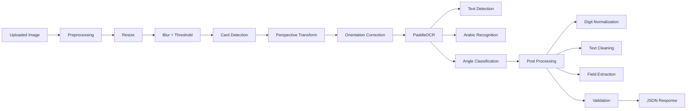

# Egyptian National ID OCR

Production-ready OCR pipeline for Egyptian National ID cards using OpenCV, PaddleOCR, and FastAPI. The system is built to handle mobile-captured card images with skew, perspective distortion, blur, noise, and uneven lighting.

## Project Overview

This project extracts:

- Full name in Arabic
- Address in Arabic
- Egyptian national ID number as a 14-digit string

The pipeline combines:

1. image preprocessing for card detection, warping, thresholding, and orientation correction
2. Arabic OCR using PaddleOCR
3. heuristic field extraction based on OCR geometry
4. post-processing and validation
5. FastAPI serving for integration in backend systems

## Architecture Diagram



## Features

- card boundary detection with largest-rectangle contour fallback
- perspective correction using four-point transform
- automatic skew correction
- Arabic OCR with angle classification
- Eastern Arabic to Western digit normalization
- field extraction heuristics for name, address, and national ID
- confidence aggregation
- OCR bounding-box visualization
- JSON export helper
- CER and WER evaluation script
- FastAPI service with Swagger UI
- Railway-ready deployment files

## Project Structure

```text
egyptian-id-ocr/
├── app/
│   ├── __init__.py
│   ├── main.py
│   ├── ocr.py
│   ├── postprocess.py
│   ├── preprocess.py
│   ├── schemas.py
│   └── utils.py
├── notebooks/
├── samples/
├── tests/
├── evaluate.py
├── Procfile
├── README.md
├── requirements.txt
└── runtime.txt
```

## Requirements

- Python 3.11+
- Linux, macOS, or Windows
- CPU deployment supported
- network access during the first PaddleOCR model download

## Installation

```bash
python -m venv .venv
source .venv/bin/activate
pip install --upgrade pip
pip install -r requirements.txt
```

On Windows PowerShell:

```powershell
python -m venv .venv
.venv\Scripts\Activate.ps1
pip install --upgrade pip
pip install -r requirements.txt
```

## Running Locally

Start the API server:

```bash
uvicorn app.main:app --host 0.0.0.0 --port 8000 --reload
```

API docs:

- Swagger UI: `http://localhost:8000/docs`
- ReDoc: `http://localhost:8000/redoc`

Health check:

```bash
curl http://localhost:8000/health
```

## FastAPI Usage

### Endpoint

`POST /extract`

### Input

- multipart form file field: `image`
- optional query flag: `annotate=true`
- optional query flag: `export_json=true`

### Sample Request

```bash
curl -X POST "http://localhost:8000/extract?annotate=true&export_json=true" \
  -H "accept: application/json" \
  -H "Content-Type: multipart/form-data" \
  -F "image=@samples/egyptian_id.jpg"
```

### Sample Response

```json
{
  "name": "محمد احمد السيد",
  "address": "القاهرة مدينة نصر",
  "national_id": "29801011234567",
  "confidence": 0.91
}
```

## Processing Pipeline

### 1. Preprocessing

- load image from file path, bytes, or `numpy.ndarray`
- resize oversized images while preserving aspect ratio
- convert to grayscale
- apply Gaussian blur
- apply adaptive thresholding
- detect the largest card-like contour
- perform four-point perspective transform
- estimate skew and rotate to horizontal text layout

### 2. OCR

PaddleOCR is initialized with Arabic support and angle classification:

```python
PaddleOCR(lang="ar", use_angle_cls=True)
```

### 3. Post Processing

- normalize Arabic digits
- clean OCR artifacts and repeated spaces
- validate Arabic name format
- validate 14-digit national ID format
- use bounding box positions to rank field candidates

## Python Usage

```python
from app.preprocess import preprocess_image
from app.ocr import get_ocr_service
from app.postprocess import build_extraction_response
from app.utils import draw_bounding_boxes, export_results_to_json

artifacts = preprocess_image("samples/egyptian_id.jpg")
tokens = get_ocr_service().extract_tokens(artifacts["card"])
result = build_extraction_response(tokens)

draw_bounding_boxes(artifacts["card"], tokens, "outputs/annotated.jpg")
export_results_to_json(result.model_dump(), "outputs/result.json")
print(result.model_dump())
```

## Evaluation

The repository includes `evaluate.py` for Character Error Rate and Word Error Rate.

Expected JSON input format:

```json
[
  {
    "reference": "محمد احمد السيد",
    "prediction": "محمد احمد السيد"
  },
  {
    "reference": "القاهرة مدينة نصر",
    "prediction": "القاهرة مدينه نصر"
  }
]
```

Run:

```bash
python evaluate.py --input evaluation_pairs.json
```

Example output:

```json
{
  "cer": 0.02,
  "wer": 0.08,
  "samples": 2
}
```

## Testing

Run the unit tests:

```bash
pytest
```

Covered utility tests:

- `normalize_digits()`
- `clean_text()`
- `validate_id()`

## Deployment

### Railway

This repository is prepared for Railway with:

- `Procfile`
- `runtime.txt`
- FastAPI app entrypoint via `uvicorn`

Recommended Railway start command:

```bash
uvicorn app.main:app --host 0.0.0.0 --port $PORT
```

Recommended environment settings:

- `PORT` provided by Railway
- `PYTHONUNBUFFERED=1`

### Docker

Build the container:

```bash
docker build -t egyptian-id-ocr .
```

Run the container locally:

```bash
docker run --rm -p 8000:8000 egyptian-id-ocr
```

The service will be available at `http://localhost:8000`.

Notes:

- the container uses `python:3.11-slim`
- system libraries required by OpenCV and PaddleOCR are installed during build
- PaddleOCR model files are downloaded on first inference unless you pre-bake them into the image

### Optional Platform Notes

The included `Dockerfile` is suitable for Railway or any standard container platform. If you deploy with Docker on Railway, point the service at the repository root and Railway will build the image directly.

## Security Notes

Egyptian national ID data is sensitive personal data and should be handled as regulated identity information.

- use HTTPS for all transport
- encrypt stored data and backups at rest
- do not persist uploaded images by default
- restrict logs so full OCR payloads and images are never emitted
- mask or hash IDs in observability pipelines when possible
- enforce short retention windows
- limit operator access with least privilege
- document deletion and subject-access workflows
- apply GDPR-style principles: data minimization, purpose limitation, storage limitation, and access control

## Future Improvements

- train a document detector specifically on Egyptian ID cards
- add super-resolution or deblurring before OCR
- add field-specific region detectors instead of heuristic extraction
- run OCR ensemble voting across raw and thresholded images
- use a learned sequence model for name and address parsing
- add batch processing and async worker queues
- add model warm-up and health diagnostics for production observability

## Notes

- first inference may be slower because PaddleOCR downloads model assets
- OCR quality depends strongly on image sharpness and card visibility
- field heuristics are production-oriented but still data-dependent; validate on your own dataset before launch
